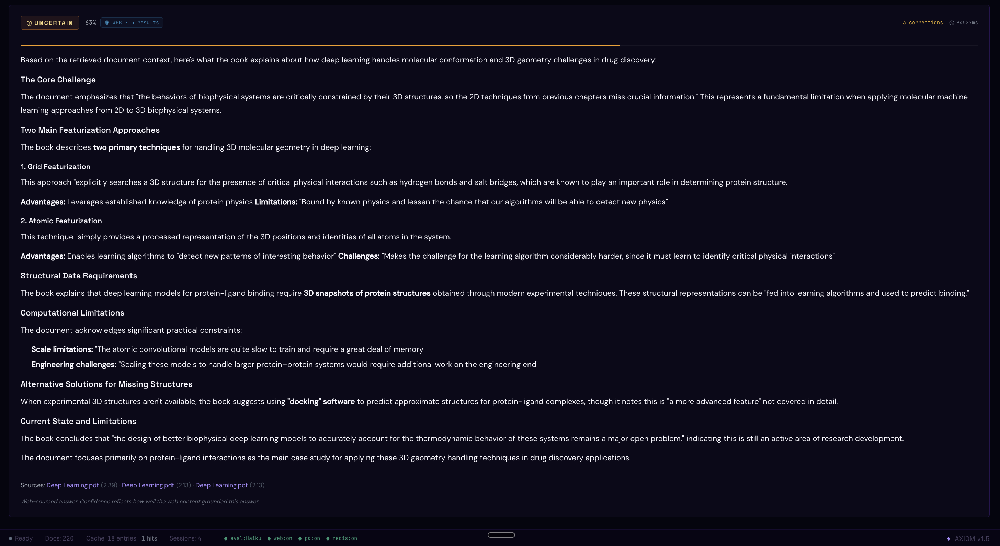

# AXIOM: Adaptive Intelligence Platform


**Adaptive RAG pipeline with a self-correcting hallucination detection loop.**

### 1 — Dashboard at Idle: Query Input, Strategy Auto-Detect, Upload, Signal Trace
The startup view. The query bar carries three strategy chips (`FACTUAL·BM25 / ABSTRACT·VECTOR / HYBRID`) that auto-highlight as you type so you see the planned retrieval path *before* you click RUN. Below it: a drop-zone for PDF / TXT / MD ingestion, which dual-indexes into BM25 and pgvector in one pass. The Signal Trace strip below shows the full 13-node LangGraph pipeline — `web_search` reserves its slot in the layout but stays invisible until Tavily actually fires, so the strip never shifts. Status-bar pills surface live `eval:Haiku · web:on · pg:on · redis:on` health and a sticky `AXIOM Connected · 14 nodes · Claude Haiku · Tavily` toast confirms the SSE channel.


### 2 — Query Entry: Strategy Selection and Document Indexing
Query: *"Explain everything the book says about how deep learning handles the challenge of molecular conformation and 3D geometry in drug discovery."* The classifier reads this as conceptual / abstract reasoning, so the `ABSTRACT·VECTOR` chip activates — semantic embeddings beat keyword matching for this kind of question. Below the strip, the upload panel shows `Deep Learning.pdf` (24.2 MB, **indexed**, 220 chunks) ready to serve as the grounding corpus. A single index pass populated both retrieval backends, so the same upload is queryable via BM25 *and* pgvector immediately.


### 3 — Pipeline Execution: Signal Trace, Reranked Chunks, RAGAS Iteration
The pipeline streams over SSE one node at a time. The Signal Trace shows the full path the query took — `classify → cache → route → vector → rerank → web → generate → evaluate → rewrite → finalize` — with the **`↺ 2/3`** correction badge confirming two rewrites fired and the `web` node lit because the corpus alone couldn't ground the answer, so Tavily was pulled in as a last-resort augmenter. **Retrieval Signal** (left, `VECTOR` chip) lists the top 5 reranked chunks from `Deep Learning.pdf` with rerank scores (`+1 2.395`, `+11 2.132`, `+11 2.128`, ...) and position deltas showing how aggressively the cross-encoder moved each chunk. **Evaluation Signal** (right) shows iteration 3 of the RAGAS critic: Faithfulness `0.72` `(+0.05)`, Relevancy `0.72`, Groundedness `0.95`, Composite `0.926` `(+0.02)`. The Score History row plots the full correction trajectory — `h1: 0.30 → h2: 0.90 → h3: 0.30 → h4: 0.30 → h5: 0.92` — showing the gate rejecting weak attempts before the final pass. Scorer: `claude-haiku-4-5-20251001`.


### 4 — Correction Record: Three Iterations of Rewrite Reasoning
When the hallucination gate fires, every rewrite is preserved as an auditable card. Iteration 1 diagnoses the original failure (*"The original query was too broad and used generic terms like 'molecular conformation' and '3D geometry' that may not match the specific technical vocabulary used in the book..."*) and the rewriter emits a tighter query: `deep learning protein structure representation drug-protein interactions 3D molecular structures computational chemistry DeepChem`. Iteration 2 narrows further toward `molecular conformation challenges 3D geometry representation conformational flexibility ligand binding poses ...`, and iteration 3 pivots toward graph neural networks and molecular dynamics terminology after the previous attempt still failed. Each card shows the *previous* faithfulness score (`0.00`, `0.00`, `0.00`) and the strategy in play (`VECTOR`), so the loop's failure trajectory is fully transparent. This is what stops the system from silently hallucinating: every gate failure becomes a visible, named decision.


### 5 — Final Answer: Structured Synthesis with VERIFIED Confidence
After web-search augmentation and the correction loop, the gate passes. The answer banner reads **VERIFIED · 87%** with a `+1 correction` chip noting the rewrite cost. The answer itself is a structured synthesis with section headings (`The Core Challenge`, `Two Main Featurization Approaches`, `Structural Data Requirements`, `Computational Limitations`, `Alternative Solutions for Missing Structures`, `Current State and Limitations`) — that structure comes from the generator following the rewritten query's framing, not from a template. Inline **bold callouts** mark the load-bearing claims: *"3D snapshots of protein structures"*, *"docking software"*, *"a 'more advanced feature' not covered in detail"*. Sources at the foot are clickable pills back to `Deep Learning.pdf` with their rerank scores; if Tavily had been the dominant source, those pills would be URLs and a `◈ WEB · N results` badge would sit beside the confidence band.



Submit a query. AXIOM classifies it, routes it to the right retrieval strategy, generates an answer, evaluates it for faithfulness against the retrieved context, and rewrites the query if the answer fails. This correction loop runs up to three times. If the answer passes, it is cached. If the corpus has no relevant chunks, the pipeline falls back to live web search via Tavily instead of wasting correction cycles. If everything fails, the system surfaces the best available answer with a confidence rating.

AXIOM is built on a LangGraph cyclic graph with 13 nodes. The hallucination gate runs on every answer. Retrieval uses BM25, pgvector, or RRF hybrid fusion depending on query type. A cross-encoder reranker scores all candidates before generation. The pipeline streams node-by-node to the frontend via Server-Sent Events, so the UI animates each stage as it fires. Everything is observable through LangSmith.

---

## What It Does

- 🔍 **Three Retrieval Strategies:** BM25 keyword search, pgvector semantic search, and RRF hybrid fusion. Query type determines which strategy fires.
- 🌐 **Web Search Fallback:** When BM25 / vector / hybrid all return zero chunks, the pipeline short-circuits to Tavily web search instead of running futile correction loops. Web URLs are surfaced as sources in the UI.
- ♻️ **Self-Correcting Hallucination Loop:** Every generated answer is evaluated for faithfulness against the retrieved (or web-sourced) context. If faithfulness < 0.75, the query is rewritten and the pipeline runs again, up to three iterations.
- 📊 **RAGAS Evaluation:** Three-dimensional scoring covering faithfulness (answer grounded in context), answer relevancy (answer addresses the question), and context groundedness (context contains the answer). Scored by Claude Haiku 4.5 in the default cloud configuration; Ollama llama3.2 supported for fully-local setups.
- 📡 **Real-Time Pipeline Streaming:** `POST /api/query/stream` emits a Server-Sent Event for every node as it completes, so the dashboard animates each stage one at a time instead of revealing the whole trace at the end.
- ⚡ **Redis Semantic Cache:** Answers that pass the hallucination gate are cached with their embedding. Identical or semantically similar future queries hit the cache directly. Cache hits are 30-50x faster than full pipeline runs.
- 🔀 **Multi-Hop Decomposition:** Complex queries are broken into sub-queries, each resolved independently, then synthesized into a single answer.
- 🔁 **Cross-Encoder Reranking:** Retrieved chunks are reranked by `cross-encoder/ms-marco-MiniLM-L-6-v2` before generation. The top 5 most relevant chunks reach the LLM.
- 🔭 **LangSmith Tracing:** Full trace tree per query covering every node, LLM call, retrieval step, and evaluation score.
- 📄 **Document Ingestion:** Upload PDFs, TXT, or Markdown files. Chunks are indexed to both BM25 and pgvector simultaneously using tiktoken token counting and NLTK sentence splitting.
- 🔒 **Rate Limiting, API Keys, and Validation:** 30 requests per minute per IP, optional `X-API-Key` header gate, file-size and content-type checks on ingest. Empty queries and queries over 2000 characters are rejected before any LLM call is made.

---

## Pipeline Flow

```
classify_query -> check_cache -> route_retrieval -> [bm25 | vector | hybrid]
    -> decompose_query -> rerank_chunks -> generate_answer -> evaluate_answer
         ^                       |                                  |
         |                       +-- (0 chunks) -> web_search ------+
         +-------------- rewrite_query <- (faith < 0.75) -----------+
                                                                    |
                                                     finalize_answer -> END
```

**Routing logic:**

```
1.  Query arrives -> classify_query assigns type: FACTUAL, ABSTRACT, TIME_SENSITIVE, MULTI_HOP
2.  check_cache -> if semantic similarity > 0.95 with a cached query, return immediately
3.  route_retrieval -> FACTUAL routes to BM25, ABSTRACT to vector, TIME_SENSITIVE/MULTI_HOP to hybrid
4.  decompose_query -> for MULTI_HOP: split into sub-queries, run each through BM25, merge results
5.  rerank_chunks -> cross-encoder scores all retrieved chunks, top 5 pass to generation
6.  if reranked_chunks is empty AND web search not yet used -> web_search (Tavily) -> generate_answer
7.  generate_answer -> Claude Sonnet generates answer from document chunks and/or web context
8.  evaluate_answer -> Claude Haiku 4.5 (or Ollama llama3.2) scores faithfulness, relevancy, groundedness
9.  if faithfulness < 0.75 AND correction_attempts < max_correction_attempts -> rewrite_query -> loop
10. if faithfulness < 0.75 AND attempts exhausted AND not FACTUAL AND web not used -> web_search -> generate
11. if faithfulness >= 0.75 OR all corrections exhausted -> finalize_answer
12. finalize_answer -> write to Redis cache if gate_passed=True -> return response
```

The web_search node fires in two distinct positions: as an immediate fallback when retrieval found nothing (path 6) and as a last resort after corrections are exhausted on a non-FACTUAL query (path 10). The FACTUAL guard on path 10 keeps the canonical-source assumption intact for terminology queries while still letting the zero-chunk early fallback (path 6) save futile correction cycles.

---

## Tech Stack

| Layer | Technology |
|---|---|
| Agent Framework | LangGraph 1.x, cyclic StateGraph, AsyncPostgresSaver checkpointing (MemorySaver fallback) |
| Generation LLM | Claude Sonnet via Anthropic API |
| Evaluation LLM | Claude Haiku 4.5 (default) or Ollama llama3.2 (optional, fully-local) |
| Retrieval (Keyword) | BM25 via rank_bm25, in-memory, hydrated from PostgreSQL on startup |
| Retrieval (Semantic) | pgvector with OpenAI text-embedding-3-small |
| Retrieval (Hybrid) | Reciprocal Rank Fusion (k=60) merging BM25 and vector rankings |
| Web Search Fallback | Tavily Search API, triggered on zero-chunk retrieval |
| Reranking | cross-encoder/ms-marco-MiniLM-L-6-v2 via sentence-transformers |
| Cache | Redis, cosine similarity semantic cache, 7-day TTL |
| Database | PostgreSQL 16 + pgvector extension (Docker); Alembic for migrations |
| Backend API | FastAPI, SSE streaming via `StreamingResponse`, async background tasks, slowapi rate limiting |
| Frontend | React 18, Tailwind CSS, native `fetch` + ReadableStream SSE consumer |
| Observability | LangSmith, full trace tree, latency per node |
| Document Parsing | pdfplumber for PDFs, tiktoken for token counting, NLTK for sentence splitting |
| CI | GitHub Actions: backend pytest + frontend build + no-source-maps check |

---

## Prerequisites

- **Python 3.11+** - check with `python3 --version`
- **Node.js 18+** - check with `node --version`
- **Docker** - for PostgreSQL + pgvector and Redis
- **Anthropic API key** - drives both answer generation (Claude Sonnet) and RAGAS evaluation (Claude Haiku 4.5 by default). Get one at [console.anthropic.com](https://console.anthropic.com).
- **OpenAI API key** - used for document embeddings via `text-embedding-3-small`. Get one at [platform.openai.com](https://platform.openai.com).
- **Tavily API key** - optional, enables the web search fallback when the corpus has no matching chunks. Free tier at [tavily.com](https://tavily.com).
- **LangSmith API key** - optional, free tier at [smith.langchain.com](https://smith.langchain.com).
- **Ollama** - optional, only if you want a fully-local evaluator. Set `USE_CLAUDE_EVALUATOR=false`, install from [ollama.ai](https://ollama.ai), and `ollama pull llama3.2`.

---

## Installation and Setup

### Step 1: Clone the repository

```bash
git clone https://github.com/nihanthnaidu007/AXIOM_Adaptive_RAG.git
cd AXIOM_Adaptive_RAG
```

### Step 2: Create your environment file

```bash
cp .env.example .env
```

Open `.env` (at the repo root — `server.py` loads from there) and fill in your keys. At minimum:

```
ANTHROPIC_API_KEY=your_anthropic_api_key_here
OPENAI_API_KEY=your_openai_api_key_here

# Optional but recommended
TAVILY_API_KEY=your_tavily_key_here          # enables web search fallback
LANGCHAIN_TRACING_V2=true
LANGCHAIN_API_KEY=your_langsmith_api_key_here
LANGCHAIN_PROJECT=axiom-rag
```

The default `USE_CLAUDE_EVALUATOR=true` uses Claude Haiku 4.5 for RAGAS. Set it to `false` only if you have Ollama installed and want fully-local evaluation. Replace the placeholder `POSTGRES_PASSWORD` and `REDIS_PASSWORD` values before any non-local deployment.

### Step 3: Start infrastructure

```bash
docker compose up -d
```

This starts PostgreSQL with the pgvector extension on port 5432 and Redis on port 6379. Both pick up `POSTGRES_PASSWORD` / `REDIS_PASSWORD` from the `.env` you just created.

### Step 4: Set up the backend

```bash
cd backend
python -m venv .venv && source .venv/bin/activate
pip install -r requirements.txt
```

### Step 5: Start the backend

```bash
uvicorn server:app --host 127.0.0.1 --port 8000 --reload
```

You should see something like:

```
INFO: server — pgvector connected — chunk_embeddings table ready
INFO: server — Redis semantic cache connected
INFO: server — Claude evaluator ready — real RAGAS evaluation enabled (model: claude-haiku-4-5-20251001)
INFO: server — Reranker: loaded
INFO: server — Web search: tavily
INFO: server — System health at startup: pgvector=connected redis=connected reranker=loaded web_search=tavily evaluator=claude-haiku
INFO:     Uvicorn running on http://127.0.0.1:8000
```

### Step 6: Start the frontend

Open a second terminal:

```bash
cd frontend
npm install
npm start
```

Open [http://localhost:3000](http://localhost:3000).

### Step 7: Upload documents

The corpus ships empty. Use the upload panel in the UI to add PDF, TXT, or Markdown files; chunks are written to BM25 and pgvector simultaneously. After uploading, the status bar shows the chunk count.

Until documents are uploaded, time-sensitive and general-knowledge queries are answered from the Tavily web search fallback (if `TAVILY_API_KEY` is set); other queries return `INSUFFICIENT_CONTEXT`.

---

## How to Use

### Running a query

1. Type a question in the query input at the top of the dashboard
2. The strategy auto-detection badge shows which retrieval path will be used
3. Click **RUN**

### What you will see

**Pipeline Strip** - Shows the active nodes firing in sequence (13 total, but conditional nodes only appear when relevant — e.g. `web` only shows when Tavily fired, and only one of `bm25`/`vector`/`hybrid` shows per query). Nodes animate one at a time as their `node_complete` SSE event arrives. The correction loop counter shows how many rewrites have occurred.

**Retrieval Signal panel** - Shows the top 5 reranked chunks with source filename, rerank score, and position delta showing how much the reranker moved each chunk up or down.

**Evaluation Signal panel** - Shows the three RAGAS scores and their history across correction iterations. When web search was used, a sky-blue note explains that low scores against thin Tavily snippets do not indicate a pipeline failure.

**Correction Record** - If the hallucination gate fired, each iteration shows the rewrite reasoning and the new query that was attempted.

**Answer panel** - The final answer with confidence band: VERIFIED (>=85%), PROBABLE (>=70%), UNCERTAIN (>=55%), UNRELIABLE (<55%). Document sources are listed with rerank scores. If the answer came from web search, a `◈ WEB · N results` badge appears next to the confidence label and the sources section shows clickable Tavily URLs instead of document filenames.

---

## Confidence Bands

```
VERIFIED    -> composite score >= 0.85, strong grounding
PROBABLE    -> composite score >= 0.70
UNCERTAIN   -> composite score >= 0.55, verify claims independently
UNRELIABLE  -> composite score < 0.55, answer may have unsupported claims

Composite = faithfulness x 0.5 + relevancy x 0.3 + groundedness x 0.2
Correction penalty = composite - (0.10 x correction_attempts)
Cache bonus = composite + (cache_similarity x 0.05), capped at 1.0
```

---

## Document Ingestion

AXIOM accepts PDF, TXT, and Markdown files through the upload panel.

**Chunking:** Documents are split into overlapping chunks using tiktoken for accurate token counting and NLTK sentence tokenizer for clean sentence boundaries. Chunk size and overlap are configurable in the environment.

**Dual indexing:** Every chunk is indexed to both BM25 (in-memory, rebuilt on startup) and pgvector (persistent). Both indexes are available immediately after upload.

**Supported formats:**
- PDF - pdfplumber extracts text page by page. Pages under 50 characters (blank or image-only) are skipped.
- TXT and Markdown - read directly, split by the same chunker.

---

## Retrieval Strategies

### BM25
Used for FACTUAL queries with specific terminology. BM25Okapi scores chunks against tokenized query terms. Returns top 20 by score, passes to reranker.

### Vector
Used for ABSTRACT queries requiring semantic matching. OpenAI `text-embedding-3-small` embeds the query. pgvector returns top 20 by cosine similarity.

### Hybrid (RRF)
Used for TIME_SENSITIVE and MULTI_HOP queries. BM25 and vector run in parallel via `asyncio.gather`. Results are merged using Reciprocal Rank Fusion with k=60. Combined ranking passed to reranker.

### Multi-hop decomposition
For complex queries, AXIOM breaks the query into sub-queries using Claude. Each sub-query runs through BM25 independently. Results are merged and synthesized into a single context before generation.

---

## Semantic Cache

Answers that pass the hallucination gate (faithfulness >= 0.75) are stored in Redis with their query embedding.

**Two-tier lookup:**
- Tier 1 (exact): normalized query string hashed and looked up directly. O(1).
- Tier 2 (semantic): cosine similarity computed over the 200 most recent cache entries. Returns if similarity > 0.95.

Cache entries expire after 7 days. Cache hits skip the entire retrieval and generation pipeline. Typical cache hit latency is 1-3 seconds vs 30-90 seconds for a full run.

---

## Evaluation

AXIOM scores three RAGAS metrics on every answer. By default the scorer is **Claude Haiku 4.5** (`claude-haiku-4-5-20251001`) via the Anthropic API — this works in every deployment environment, including cloud. Setting `USE_CLAUDE_EVALUATOR=false` switches to **Ollama llama3.2** running locally.

**Faithfulness** - Are the claims in the answer supported by the retrieved context? This is the primary hallucination gate metric. Threshold: 0.75.

**Answer Relevancy** - Does the answer actually address the question that was asked?

**Context Groundedness** - Does the retrieved context contain the information needed to answer the question?

If the configured evaluator is unreachable at request time, the pipeline does not silently pass — scores come back as `evaluation_mode: "parse_error"` and the hallucination gate treats them as below-threshold, forcing the correction loop and surfacing the degraded state in `system_health` on the API response. The system never returns a fake "pass" when evaluation is broken.

Using a separate evaluator model from the generation model (Haiku rather than Sonnet, or local Ollama vs. cloud Claude) keeps the critic independent of the writer and reduces self-grading bias.

---

## LangSmith Tracing

Every query produces a full trace at [smith.langchain.com](https://smith.langchain.com).

The trace shows:
- `classify_query` - classification result and reasoning
- `check_cache` - cache hit/miss and similarity score if near-hit
- `route_retrieval` - strategy selected and why
- `retrieve_bm25` / `retrieve_vector` / `retrieve_hybrid` - chunk count, top score, latency
- `decompose_query` - sub-queries generated (multi-hop) or skip reason
- `rerank_chunks` - pre/post rerank positions, reranker_mode (real or fallback)
- `web_search` - Tavily query, depth (basic / advanced), result count, used as fallback or post-correction
- `generate_answer` - prompt tokens, completion tokens, latency, web_augmented flag
- `evaluate_answer` - all three RAGAS scores, evaluation_mode (real / parse_error), scorer_model
- `rewrite_query` - rewrite reasoning, new query (appears once per correction iteration)
- `finalize_answer` - gate_passed, confidence band, cache write result

The LangSmith trace URL is surfaced in the status bar of the UI for every completed query.

---

## API Endpoints

| Method | Endpoint | Description |
|---|---|---|
| `GET`  | `/api/health` | System health: service status, index counts, stub_mode |
| `GET`  | `/api/stats` | Cache stats, session count, doc counts |
| `POST` | `/api/query` | Run a query through the full pipeline, return the complete `QueryResponse` |
| `POST` | `/api/query/stream` | Server-Sent Events: one `node_complete` event per graph node, then `done`, then `[DONE]` |
| `POST` | `/api/ingest` | Upload a document (PDF / TXT / MD) for indexing |
| `GET`  | `/api/trace/{session_id}` | Fetch the saved pipeline trace for a session |
| `GET`  | `/api/session/{session_id}/state` | Inspect the last checkpointed graph state |
| `POST` | `/api/eval/run` | Start the 30-query benchmark suite in the background |
| `GET`  | `/api/eval/status/{job_id}` | Poll eval job progress |
| `POST` | `/api/eval/run/stream` | Stream eval suite progress over SSE (alternative to polling) |
| `GET`  | `/api/eval/results` | Return the last saved `eval_results.json` |

All `POST` endpoints accept an optional `X-API-Key` header. The header is required when `API_KEY` is set in the environment, ignored otherwise.

### Example: Run a query

```bash
curl -X POST "http://localhost:8000/api/query" \
  -H "Content-Type: application/json" \
  -d '{"query": "What is the BM25 Okapi term frequency formula?", "session_id": null}'
```

Response (fields trimmed for brevity):

```json
{
  "session_id": "5f6a3b2c-...-...",
  "final_answer": "BM25 scores documents using ...",
  "confidence": { "label": "VERIFIED", "score": 0.89, "reasoning": "..." },
  "retrieval_strategy": "bm25",
  "evaluation_mode": "real",
  "correction_attempts": 0,
  "served_from_cache": false,
  "total_latency_ms": 4231.0,
  "ragas_scores": {
    "faithfulness": 0.90,
    "answer_relevancy": 0.88,
    "context_groundedness": 0.85,
    "composite_score": 0.886,
    "scorer_model": "claude-haiku-4-5-20251001",
    "evaluation_mode": "real"
  },
  "reranked_chunks": [ /* top 5 with source, rerank_score, content */ ],
  "trace_steps": [ /* one entry per node fired */ ],
  "web_search_used": false,
  "web_search_chunks": [],
  "document_chunk_count": 5,
  "web_chunk_count": 0,
  "system_health": {
    "pgvector": "connected", "redis": "connected", "reranker": "loaded",
    "web_search": "tavily", "evaluator": "claude-haiku"
  },
  "langsmith_trace_url": "https://smith.langchain.com/runs/..."
}
```

### Example: Stream a query (SSE)

```bash
curl -N -X POST "http://localhost:8000/api/query/stream" \
  -H "Content-Type: application/json" \
  -d '{"query": "Explain cross-encoder reranking", "session_id": null}'
```

```
data: {"type": "node_complete", "trace_step": {"node_name": "classify_query", "status": "complete", ...}}

data: {"type": "node_complete", "trace_step": {"node_name": "check_cache", "status": "complete", ...}}

... (one event per node as it fires) ...

data: {"type": "done", "result": { /* full QueryResponse, same shape as POST /api/query */ }}

data: [DONE]
```

### Example: Health check

```bash
curl "http://localhost:8000/api/health"
```

```json
{
  "status": "ok",
  "graph_compiled": true,
  "stub_mode": false,
  "nodes": ["classify_query", "check_cache", "route_retrieval", "retrieve_bm25",
            "retrieve_vector", "retrieve_hybrid", "decompose_query", "rerank_chunks",
            "web_search", "generate_answer", "evaluate_answer", "rewrite_query",
            "finalize_answer"],
  "index_status": {
    "bm25": "ready", "bm25_doc_count": 0,
    "vector": "ready", "vector_doc_count": 0,
    "reranker": "loaded"
  },
  "services": {
    "postgres": "connected",
    "redis": "connected",
    "evaluator": "claude-haiku",
    "web_search": "tavily",
    "reranker": "loaded"
  },
  "system_health": {
    "pgvector": "connected", "redis": "connected", "reranker": "loaded",
    "web_search": "tavily", "evaluator": "claude-haiku"
  },
  "langsmith": "enabled",
  "checkpointing": "enabled (MemorySaver)"
}
```

---

## Benchmark Results

Run the evaluation suite:

```bash
cd backend
curl -X POST http://localhost:8000/api/eval/run \
    -H "X-API-Key: your_key" | python -m json.tool
# Poll with returned job_id
curl http://localhost:8000/api/eval/status/{job_id} \
    -H "X-API-Key: your_key"
```

| Metric | Value |
|---|---|
| Completion Rate | 100.0% (30/30) |
| Strategy Classification Accuracy | 70.0% |
| Avg Faithfulness Score | 0.538 |
| Avg Answer Relevancy | 0.557 |
| Avg Context Groundedness | 0.478 |
| Avg Composite RAGAS Score | 0.532 |
| Correction Rate | 70.0% |
| Avg Corrections per Query | 2.0 |
| Correction Success Rate | 100.0% |
| Cache Hit Rate (after warmup) | 0.0% |
| Avg Query Latency | 34,484 ms |
| P95 Query Latency | 58,412 ms |
| Keyword Hit Rate | 78.1% |
| Scorer Model | claude-haiku-4-5-20251001 |

*Last run: 2026-05-30, Claude Haiku 4.5 evaluation, corpus: AXIOM documentation.*

**Category breakdown:**

| Category | Completed | Strategy Accuracy | Avg Composite | Notes |
|---|---|---|---|---|
| FACTUAL | 5/5 | 100% | 0.38 | BM25 routing correct on all 5; low composite reflects corpus gaps on specific terms (IVFFlat, RRF k-value) |
| ABSTRACT | 5/5 | 100% | 0.91 | Vector routing correct on all 5; highest-scoring category, corpus covers these concepts well |
| TIME_SENSITIVE | 5/5 | 80% | 0.37 | 1 routed to vector instead of hybrid; low composite expected — "latest" queries are not grounded in static documentation |
| MULTI_HOP | 5/5 | 80% | 0.37 | 1 routed to vector instead of hybrid; low composite for same reason as TIME_SENSITIVE |
| STRESS_CORRECTION | 5/5 | 0% (by design) | 0.74 | Vague queries resolve via vector, not hybrid — expected behavior; 3/5 passed evaluation |
| EDGE_CASES | 5/5 | 60% | 0.41 | All completed (vs 1 timeout in prior run); mixed results on ambiguous routing queries |

**Comparing to the previous Ollama run (2026-03-29):**

| Metric | Ollama llama3.2 | Claude Haiku 4.5 | Change |
|---|---|---|---|
| Completion Rate | 86.7% (26/30) | 100% (30/30) | +13.3pp |
| Strategy Accuracy | 60.0% | 70.0% | +10pp |
| Avg Composite RAGAS | 0.607 | 0.532 | -0.075 |
| Avg Latency | 77,472 ms | 34,484 ms | -55% |
| P95 Latency | 120,022 ms | 58,412 ms | -51% |
| Timeouts | 4 | 0 | -4 |

The lower composite RAGAS score under Claude Haiku reflects stricter evaluation, not pipeline regression. Haiku scores faithfulness and groundedness as 0.0 when an answer cannot be grounded in the retrieved context. Ollama returned graded partial scores (0.3–0.5) for the same gap. For TIME_SENSITIVE and MULTI_HOP queries against static documentation that does not contain current information, 0.0 faithfulness is the correct honest verdict. The ABSTRACT category — where the corpus actually covers the questions — scores 0.91 composite, confirming the pipeline produces high-quality grounded answers when given relevant documents.

## Project Structure

```
AXIOM_Adaptive_RAG/
├── docker-compose.yml                     <- PostgreSQL (pgvector) + Redis
├── README.md
├── DEPLOYMENT.md                          <- Railway/Vercel production guide
├── .env.example                           <- Copy to .env at the repo root
├── .github/workflows/ci.yml               <- pytest + frontend build, no source maps
├── backend/
│   ├── server.py                          <- FastAPI app, /api/query and /api/query/stream (SSE),
│   │                                          rate limiting, session management, persistence
│   ├── requirements.txt
│   ├── alembic/                           <- Database migrations (alembic)
│   │   └── versions/22496c2e6b17_initial_schema.py
│   ├── scripts/start.sh                   <- Docker-up + uvicorn launcher
│   ├── axiom/
│   │   ├── config.py                      <- All tunable parameters, thresholds, top_k values, timeouts
│   │   ├── llm/
│   │   │   └── client.py                  <- Shared Anthropic client singleton
│   │   ├── graph/
│   │   │   ├── state.py                   <- AxiomState TypedDict, all pipeline fields
│   │   │   ├── graph.py                   <- StateGraph with cyclic edges + web-search routing
│   │   │   ├── builder.py                 <- Compose nodes into the StateGraph
│   │   │   ├── sub_query_runner.py        <- Multi-hop sub-query executor
│   │   │   └── nodes/
│   │   │       ├── classify_query.py      <- Claude Sonnet, FACTUAL/ABSTRACT/TIME_SENSITIVE/MULTI_HOP
│   │   │       ├── check_cache.py         <- Redis two-tier lookup (exact + cosine similarity)
│   │   │       ├── route_retrieval.py     <- Pure routing, no LLM
│   │   │       ├── retrieve_bm25.py       <- rank_bm25.BM25Okapi
│   │   │       ├── retrieve_vector.py     <- pgvector async query
│   │   │       ├── retrieve_hybrid.py     <- asyncio.gather BM25+vector, RRF merge
│   │   │       ├── decompose_query.py     <- Multi-hop sub-query runner
│   │   │       ├── rerank_chunks.py       <- CrossEncoder ms-marco-MiniLM-L-6-v2
│   │   │       ├── web_search_node.py     <- Tavily fallback (zero-chunk + post-correction paths)
│   │   │       ├── generate_answer.py     <- Claude Sonnet with retry logic, web-augmented
│   │   │       ├── evaluate_answer.py     <- RAGAS via Claude Haiku (or Ollama)
│   │   │       ├── rewrite_query.py       <- Claude Sonnet query rewriter
│   │   │       └── finalize_answer.py     <- Gate logic, cache write, confidence band
│   │   ├── search/
│   │   │   └── web_search.py              <- Tavily client wrapper, depth/results config
│   │   ├── retrieval/
│   │   │   ├── bm25_index.py              <- BM25Index singleton, hydrated from pgvector on startup
│   │   │   ├── vector_store.py            <- Async SQLAlchemy + pgvector
│   │   │   ├── embeddings.py              <- OpenAI text-embedding-3-small singleton
│   │   │   ├── hybrid_fusion.py           <- Reciprocal Rank Fusion k=60
│   │   │   └── reranker.py                <- CrossEncoderReranker with fallback
│   │   ├── evaluation/
│   │   │   ├── claude_evaluator.py        <- Default RAGAS scorer (Claude Haiku 4.5)
│   │   │   ├── critic_llm.py              <- Ollama HTTP client (optional local evaluator)
│   │   │   ├── ragas_scorer.py            <- Three-metric prompt template
│   │   │   └── thresholds.py              <- Confidence band definitions
│   │   ├── cache/
│   │   │   └── semantic_cache.py          <- Redis semantic cache, two-tier lookup, sorted index
│   │   ├── ingest/
│   │   │   ├── loader.py                  <- pdfplumber, tiktoken chunker, NLTK sentence splitter
│   │   │   └── indexer.py                 <- Dual BM25 + pgvector writer
│   │   ├── observability/
│   │   │   └── langsmith.py               <- LangSmith RunnableConfig
│   │   └── eval_suite/
│   │       ├── benchmark.py               <- 30 queries across 6 categories
│   │       ├── runner.py                  <- Benchmark runner, aggregate metrics, background job
│   │       └── stress_test.py             <- Targeted correction-loop stress harness
│   └── tests/                             <- pytest suite (60 tests):
│       ├── test_bm25_index.py
│       ├── test_claude_evaluator.py
│       ├── test_confidence_band.py
│       ├── test_cosine_similarity.py
│       ├── test_embedding_dimension.py
│       ├── test_ragas_scorer.py
│       ├── test_system_health.py
│       └── test_web_search_fallback.py
├── frontend/
│   └── src/
│       ├── App.js                         <- Main dashboard, SSE consumer, API wiring
│       ├── index.css                      <- MERIDIAN design system
│       └── components/axiom/
│           ├── QueryInput.js
│           ├── PipelineStrip.js           <- 13-node pipeline, animates per SSE node_complete
│           ├── SignalPanel.js             <- Retrieved chunks with rerank scores
│           ├── EvaluationPanel.js         <- RAGAS scores, web-context note
│           ├── CorrectionRecord.js        <- Per-iteration rewrite reasoning
│           ├── AnswerPanel.js             <- Final answer, confidence + WEB badges, doc/web sources
│           ├── StatusBar.js               <- Docs count, cache entries, system health pills
│           ├── UploadPanel.js             <- Document upload and index status
│           └── HexBackground.js           <- Animated topology background
```

---

## Troubleshooting

**Backend won't start - `KeyError: ANTHROPIC_API_KEY`**

Make sure `.env` exists at the repo root and that `ANTHROPIC_API_KEY` and `OPENAI_API_KEY` are populated:
```bash
cp .env.example .env
```

**`pgvector connection failed` or `Redis cache connection failed`**

Docker containers are not running, or `POSTGRES_PASSWORD` / `REDIS_PASSWORD` in `.env` do not match the values the running containers were started with. Restart cleanly:
```bash
docker compose down
docker compose up -d
docker compose ps
```
Both `postgres` and `redis` should report `(healthy)`.

**`BM25 hydrated - 0 chunks loaded`**

No documents have been indexed yet. Upload files through the UI upload panel. Until then, only queries that route to the Tavily web search fallback will produce grounded answers.

**Queries return `INSUFFICIENT_CONTEXT`**

The corpus has no matching chunks AND the web search fallback either did not fire or returned no usable results. If `TAVILY_API_KEY` is unset, only document-sourced answers are possible — upload relevant documents.

**`evaluation_mode: "parse_error"` in every response**

The Claude evaluator cannot reach the Anthropic API. Check that `ANTHROPIC_API_KEY`
is set correctly in `backend/.env`. If using local Ollama instead, set
`USE_CLAUDE_EVALUATOR=false` and ensure Ollama is running.

**Frontend shows degraded health pills in status bar**

Check `/api/health` for `system_health` details. Common causes:
- `evaluator: claude-haiku/unreachable` — Anthropic API key missing or network issue
- `reranker: not_loaded` — CrossEncoder model failed to download at startup
- `pgvector: not_connected` — Postgres container not running

**Pipeline strip lights up all at once instead of animating**

The frontend is using `/api/query` (buffered) instead of `/api/query/stream` (SSE), or your reverse proxy is buffering SSE chunks. Confirm `QueryInput`'s `onSubmit` is wired to `handleSubmitStreaming` in `App.js`, and that any nginx/cloudflare layer in front of the backend has `proxy_buffering off` (the streaming endpoint already sets `X-Accel-Buffering: no`).

**Rate limit hit - HTTP 429**

`/api/query` and `/api/query/stream` each allow 30 requests per minute per IP. The eval suite is internal and is not subject to this limit.

---

## Configuration

All tunable parameters live in the config module. Key values:

| Parameter | Default | Description |
|---|---|---|
| `faithfulness_threshold` | 0.75 | Minimum faithfulness to pass hallucination gate |
| `relevancy_threshold` | 0.70 | Minimum relevancy score |
| `groundedness_threshold` | 0.65 | Minimum groundedness score |
| `max_correction_attempts` | 3 | Maximum rewrite iterations before finalizing |
| `bm25_top_k` | 20 | Chunks returned by BM25 before reranking |
| `vector_top_k` | 20 | Chunks returned by vector search before reranking |
| `rerank_top_k` | 5 | Chunks that pass reranker to reach generation |
| `cache_similarity_threshold` | 0.95 | Cosine similarity required for cache hit |
| `cache_ttl_seconds` | 604800 | Cache entry lifetime (7 days) |

---

## Environment Variables Reference

| Variable | Required | Description |
|---|---|---|
| `ANTHROPIC_API_KEY` | Yes | Powers Claude Sonnet (generation) and Claude Haiku (default evaluator) |
| `OPENAI_API_KEY` | Yes | Powers `text-embedding-3-small` for document and cache embeddings |
| `USE_CLAUDE_EVALUATOR` | No | `true` (default) uses Claude Haiku for RAGAS; `false` uses local Ollama |
| `TAVILY_API_KEY` | No | Enables the web search fallback. Leave empty to disable web search entirely |
| `TAVILY_SEARCH_DEPTH` | No | `basic` or `advanced`; the node auto-promotes to `advanced` on empty corpus |
| `TAVILY_MAX_RESULTS` | No | Tavily results per call (default 5) |
| `POSTGRES_HOST` / `_PORT` / `_USER` / `_PASSWORD` / `_DB` | No | PostgreSQL connection components (defaults match docker-compose) |
| `POSTGRES_URL` | No | Full psycopg URL used by the LangGraph checkpointer |
| `DATABASE_URL` | No | Full asyncpg URL used by vector_store / persistence |
| `REDIS_HOST` / `_PORT` / `_PASSWORD` | No | Redis connection components |
| `API_KEY` | No | When set, all `POST` endpoints require this value in the `X-API-Key` header |
| `CORS_ORIGINS` | No | Comma-separated list, default `http://localhost:3000` |
| `QUERY_GRAPH_TIMEOUT_SEC` | No | Graph invocation timeout in seconds for `/api/query` (default 180) |
| `LANGCHAIN_TRACING_V2` | No | Set to `true` to enable LangSmith tracing |
| `LANGCHAIN_API_KEY` | No | LangSmith API key |
| `LANGCHAIN_PROJECT` | No | LangSmith project name (default: `axiom-rag`) |

---

## Key Design Decisions

**Why a cyclic graph instead of a linear chain?**

The correction loop requires the graph to return to an earlier node after evaluation. A linear chain cannot express this without re-running from the start and wasting the retrieval work already done. The cyclic LangGraph routes back to `rewrite_query` and then to retrieval without touching the nodes that already ran.

**Why BM25 and vector search together?**

BM25 is strong on exact terminology: technical names, formulas, specific phrases. Vector search is strong on semantic meaning: paraphrases, concepts, intent. Neither alone is sufficient. The hybrid path runs both in parallel and merges via RRF so neither ranking dominates.

**Why a cross-encoder for reranking instead of just using vector scores?**

Bi-encoder vector scores (used in retrieval) are computed independently for the query and each document. Cross-encoders see the query and document together, which produces more accurate relevance judgments. The tradeoff is speed: cross-encoders are too slow to run over thousands of documents but fast enough for the top 20 retrieved candidates.

**Why a different model for evaluation than for generation?**

Using the same model to write *and* grade an answer introduces self-grading bias. AXIOM defaults to Claude Haiku 4.5 as the RAGAS scorer while Claude Sonnet writes — different model family, different capability profile, materially different judgment. Setting `USE_CLAUDE_EVALUATOR=false` swaps in Ollama llama3.2 as the critic, which is even more strongly decoupled (different vendor, runs locally, zero per-call cost) at the price of needing Ollama installed.

**Why Redis for caching instead of a vector database?**

The cache is small (bounded to recent queries) and needs sub-second lookup. Redis with a cosine similarity scan over the 200 most recent entries is fast enough and avoids adding another infrastructure dependency. At larger scale this would be replaced with a proper ANN index.

---

## Contributing

PRs welcome. See [CONTRIBUTING.md](CONTRIBUTING.md) for the development
workflow, the pull-request checklist, and the commit-message conventions.
Bug reports and feature requests use the issue templates in
[`.github/ISSUE_TEMPLATE/`](.github/ISSUE_TEMPLATE/).

---

## Security

Do **not** open a public issue for security problems. See
[SECURITY.md](SECURITY.md) for the private disclosure process and the
hardening recommendations for operators.

---

## License

[MIT](LICENSE) © 2026 Nihanth Naidu Kalisetti
